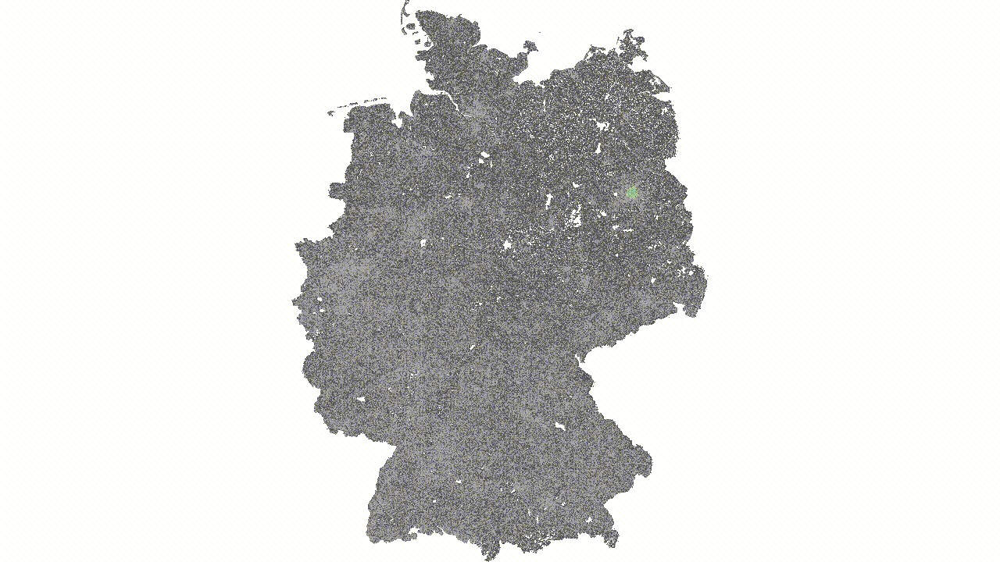

# GPUSSSP

This project is an _experiment_ of implementing well-known Single-Source Shortest Path algorithms on the GPU using C++ and Vulkan with GLSL compute shaders.
We exclusively focus on _road networks_, because these algorithms usually do _not_ fare well there compared to CPU-based algorithms.
The journey to learn about the state-of-the-art algorithms was documented in this [blog series](https://www.execfoo.de/blog/deltastep.html).
We implement a naive Delta-Step algorithm, Near-Far and Bellman-Ford.
There is plenty of future work. We explored the ADDS algorithm in detail, but porting the implementation faithfully to Vulkan/GLSL is rather complex.


_Shortest-Path search with Near-Far on Germany. Orange is the far bucket, light-green the near bucket and dark-green the settled nodes._

## Disclaimer

There are no plans to make this into a production-grade service or library right now.
For the sake of your own sanity, if you plan to use parts of this for your own project please reach out to @TheMarex.

We have used AI tools liberally in some areas of the code base and made an effort to mark those less scrutinized spots (for example, the visualization, experimentation runner).
Though a large portion of the "routing boilerplate" is from [charge](https://github.com/TheMarex/charge.git) (which was a Master's Thesis) which arguably may be even worse in terms of code reliability.
The baseline for this exploration is a very simple Dijkstra implementation.
The priority queue is taken from Ben Strasser's [RoutingKit](https://github.com/RoutingKit/RoutingKit/blob/master/include/routingkit/id_queue.h) because that is the fastest implementation known to us.

## Usage

To download some OpenStreetMap data in PBF-format, please refer to the excellent [OSM data mirror](https://download.geofabrik.de/) from Geofabrik.

### Building

```sh
cmake -B build -DCMAKE_BUILD_TYPE=Release
cmake --build build -j$(nproc)
```

### Preprocessing

```sh
mkdir -p ../cache/berlin
./osm2graph ../data/berlin-latest.osm.pbf ../cache/berlin
./graph_reorder zorder ../cache/berlin ../cache/berlin_zorder
```

### Running

To run all available algorithms (default) on the same random queries run:

```sh
./gpusssp ../cache/berlin_zorder -n 100 --skip bellmanford --delta 16000 --batch-size 256
```

To run specific queries you can input the node IDs or `lon,lat` coordinates:

```sh
./gpusssp ../cache/berlin_zorder -s 44958 -t 44968
```

### Experiments

We keep an experiment log in [EXPERIMENTS.md](./EXPERIMENTS.md).
Since the actual experiment branches contain a lot of data, they are not pushed to the remote.

See [experiments/README.md](./experiments/README.md) for a detailed explanation on how to use the tooling to run your own experiments.
If you use OpenCode there is a `Labrat` agent shipped with this repository that will know how to setup and run experiments.
